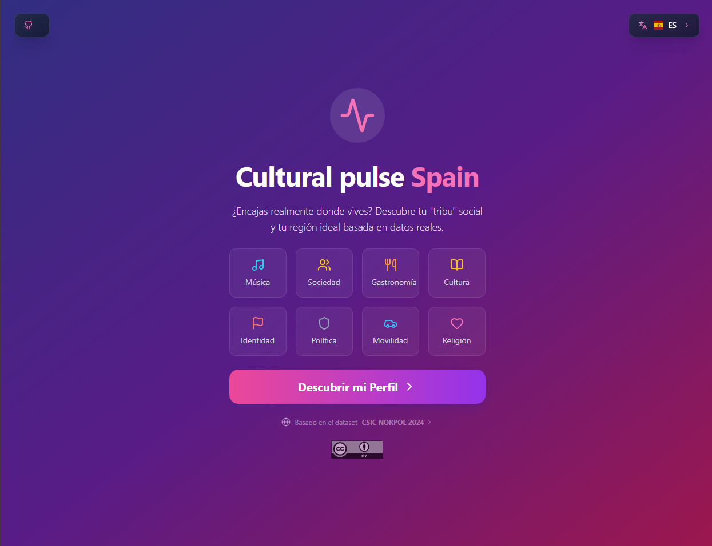
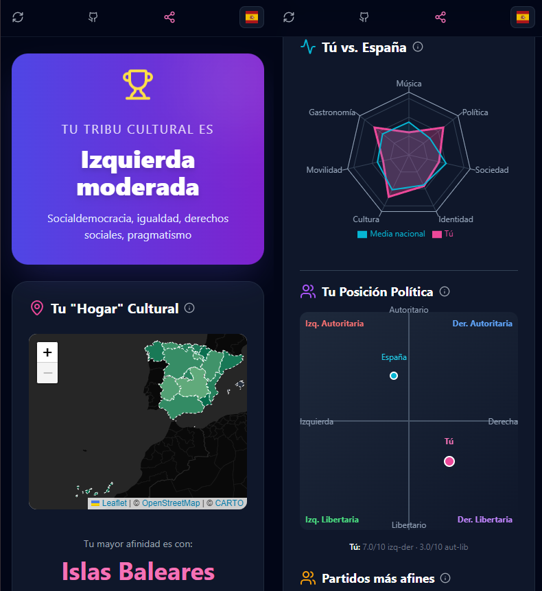

# Spain - Cultural Pulse
[](README.md)
[](README.en.md)

Aplicación web interactiva para explorar cultura, valores y política en España contemporánea a través de visualizaciones que se nutren de datos abiertos.

- **[Ver Demo](https://mjanez.github.io/spain-cultural-pulse)**





## Sobre el proyecto

Desarrollada con Next.js que permite analizar y visualizar patrones culturales y sociales en España. Los datos provienen de una encuesta representativa de 3.000 adultos españoles realizada en 2024.

## Tecnologías

- **Framework:** Next.js 14 (App Router)
- **Visualización:** Recharts / D3.js
- **Estilos:** Tailwind CSS
- **Deployment:** [GitHub Pages](#despliegue)/Vercel

## Fuente de datos

Basado en el [Estudio sobre Normas Sociales en la Política, 2024](https://datos.gob.es/es/catalogo/ea0020951-estudio-sobre-normas-sociales-en-la-politica-2024) del CSIC.

> **Muestra:** 3.000 adultos españoles (encuesta online, junio 2024)  
> **Panel:** Netquest  
> **Representatividad:** género, edad, educación, región y tamaño de municipio

## Licencia

Este proyecto está licenciado bajo [Creative Commons Attribution 4.0 International (CC BY 4.0)](LICENSE). Puedes usar, compartir y adaptar este trabajo siempre que des la atribución apropiada.

## Qué analiza

- **Cultura y ocio:** preferencias musicales, deportivas, alimentación y moda
- **Movilidad:** hábitos de transporte y desplazamientos
- **Valores personales:** amor, sexualidad y relaciones
- **Actitudes políticas:** igualdad, inmigración, medio ambiente y género
- **Política:** orientación ideológica, intención de voto y polarización

## Instalación

```bash
npm install
npm run dev
```

## Despliegue

El proyecto se despliega automáticamente en GitHub Pages mediante GitHub Actions cuando se hace push a la rama `main`.

**Configuración necesaria:**
1. Ir a Settings → Pages en GitHub
2. Source: GitHub Actions
3. El sitio estará disponible en: `https://[usuario].github.io/spain-cultural-pulse`

**Deploy manual:**
```bash
npm run build
```

## Licencia

Este proyecto está licenciado bajo [Creative Commons Attribution 4.0 International (CC BY 4.0)](LICENSE). Puedes usar, compartir y adaptar este trabajo siempre que des la atribución apropiada.
